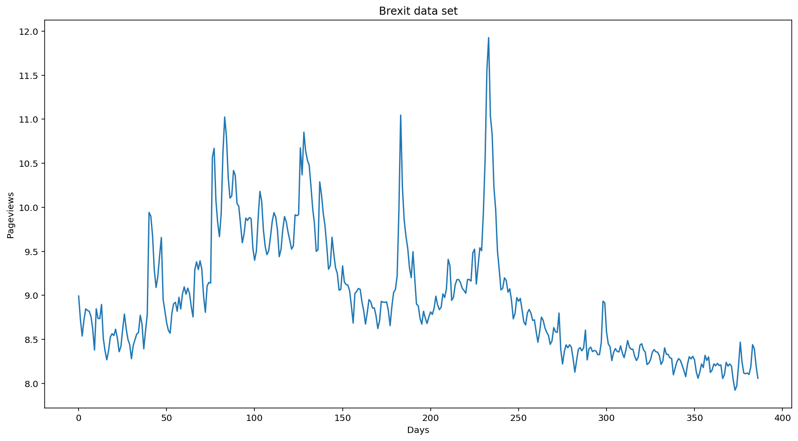
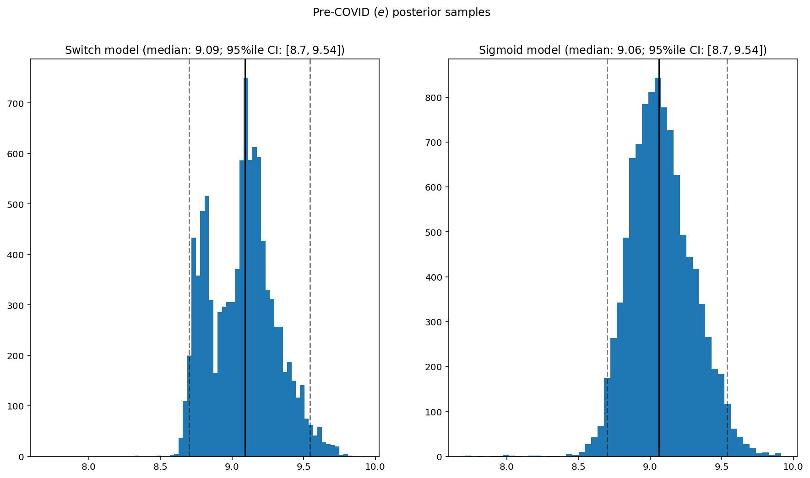
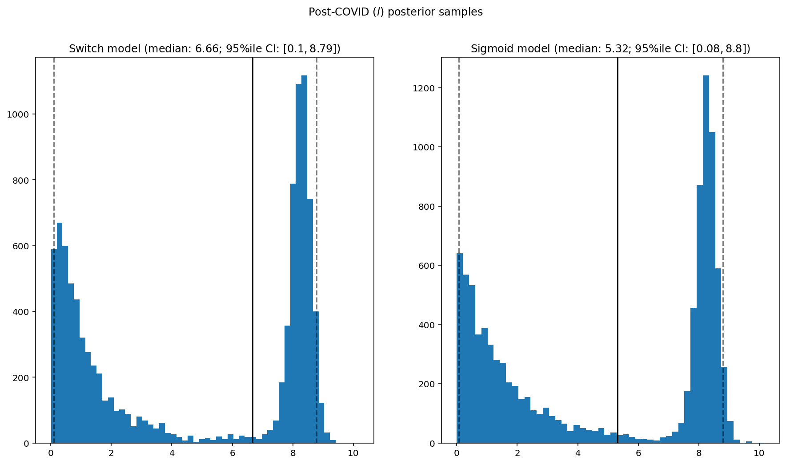
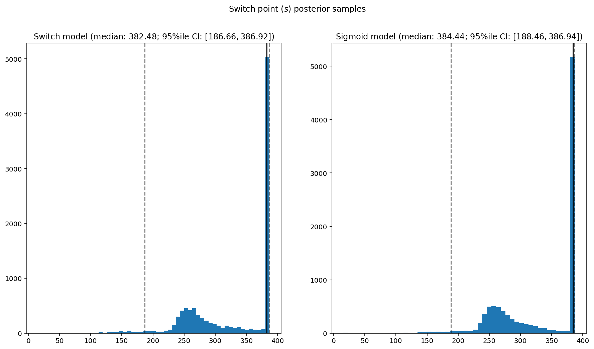

[Home](https://mgcodesandstats.github.io/) |
[GitHub](https://github.com/mgcodesandstats) |
[Speaking Engagements](https://mgcodesandstats.github.io/speaking-engagements/) |
[Terms](https://mgcodesandstats.github.io/terms/) |
[E-mail](mailto:contact@michael-grogan.com)

# TensorFlow Probability: Analysing "Brexit" page views with Bayesian Switchpoint Analysis

The TensorFlow probability library allows for detailed data analysis using statistics and probability methodologies. In addition, this library is also quite effective at detecting "switch points" in a time series, or periods of significant change.

In this instance, TensorFlow Probability is used to detect the switchpoint for a time series indicating page views for the term "Brexit" on a daily basis. The time series is available from [Wikimedia Toolforge](https://pageviews.toolforge.org/?project=en.wikipedia.org&platform=all-access&agent=user&redirects=0&start=2019-06-13&end=2020-07-03&pages=Brexit), and the time series ranges from June 2019 to July 2020.

The examples illustrated in this article use the template from the [Bayesian Switchpoint Analysis](https://www.tensorflow.org/probability/examples/Bayesian_Switchpoint_Analysis#prerequisites) tutorial, of which the original authors **(Copyright 2019 The TensorFlow Authors)** have made available under the Apache 2.0 license.

## Background

Since the onset of COVID-19, there has been decreased media interest in the Brexit event than previously.

This is evidenced by a significant decline in the overall trend for page views of the term per day, as well as a sharp decline in "spikes" of page view interest for the term. The time series is expressed in logarithmic format in order to smooth out the series.



Using *tensorflow_probability*, posterior samples are created in order to generate a probability distribution for the pre and post-COVID periods, which will be estimated by the model. The purpose of a posterior distribution is to assign a probability to potential future events on the basis of prior probability multiplied by the likelihood function (which is used to generate probable parameters of the probability distribution using the maximum likelihood estimator).

## Methodology

Probabilities are calculated for both the switch model and sigmoid model.

```
def target_log_prob_fn(model, s, e, l):
  return model.log_prob(s=s, e=e, l=l, d_t=brexit_data)

models = [model_switch, model_sigmoid]
print([target_log_prob_fn(m, 40., 3., .9).numpy() for m in models])  # Somewhat likely result
print([target_log_prob_fn(m, 60., 1., 5.).numpy() for m in models])  # Rather unlikely result
print([target_log_prob_fn(m, -10., 1., 1.).numpy() for m in models]) # Impossible result
```

## Switchpoint Analysis

This analysis is based on the assumption that a switchpoint is present in the time series, i.e. a point at which there is a significant "shift" in the parameters of the time series.

In the original example referenced by the TensorFlow Blog as above, the switchpoint was based on a year for which safety regulations for the mining industry changed in the UK, and accidents declined accordingly.

For this example, the switchpoint is assumed to be the point at which COVID-19 became mainstream media news, and interest in the Brexit event declined accordingly - as evidenced by a decline in page views for the term "Brexit".

To do this, a Hamiltonian Monte Carlo (HMC) method is used for sampling from the relevant posterior distributions. This post gives much more detail on the [HMC method](https://colindcarroll.com/2019/04/11/hamiltonian-monte-carlo-from-scratch/), but the ultimate objective of using this technique is to update the posterior samples based on Hamilton's equations (a type of differential equation), in order to account for updated probability readings in the Monte Carlo simulation.

The states here are defined as **pre-covid** and **post-covid**.

```
num_results = 10000
num_burnin_steps = 3000

@tf.function(autograph=False, experimental_compile=True)
def make_chain(target_log_prob_fn):
   kernel = tfp.mcmc.TransformedTransitionKernel(
       inner_kernel=tfp.mcmc.HamiltonianMonteCarlo(
          target_log_prob_fn=target_log_prob_fn,
          step_size=0.05,
          num_leapfrog_steps=3),
       bijector=[
          tfb.Sigmoid(low=0., high=tf.cast(len(date), dtype=tf.float32)),
          tfb.Softplus(),
          tfb.Softplus(),
      ])
   kernel = tfp.mcmc.SimpleStepSizeAdaptation(
        inner_kernel=kernel,
        num_adaptation_steps=int(0.8*num_burnin_steps))

   states = tfp.mcmc.sample_chain(
      num_results=num_results,
      num_burnin_steps=num_burnin_steps,
      current_state=[
          # The three latent variables
          tf.ones([], name='init_switchpoint'),
          tf.ones([], name='init_pre_covid_rate'),
          tf.ones([], name='init_post_covid_rate'),
      ],
      trace_fn=None,
      kernel=kernel)
   return states

switch_samples = [s.numpy() for s in make_chain(
    lambda *args: target_log_prob_fn(model_switch, *args))]
sigmoid_samples = [s.numpy() for s in make_chain(
    lambda *args: target_log_prob_fn(model_sigmoid, *args))]

switchpoint, pre_covid_rate, post_covid_rate = zip(
    switch_samples, sigmoid_samples)
```

Then, the posterior distributions for the two states are generated:

```
def _desc(v):
  return '(median: {}; 95%ile CI: $[{}, {}]$)'.format(
      *np.round(np.percentile(v, [50, 2.5, 97.5]), 2))

for t, v in [
    ('Pre-COVID ($e$) posterior samples', pre_covid_rate),
    ('Post-COVID ($l$) posterior samples', post_covid_rate),
    ('Switch point ($s$) posterior samples', date[0] + switchpoint),
]:
  fig, ax = plt.subplots(nrows=1, ncols=2, sharex=True)
  for (m, i) in (('Switch', 0), ('Sigmoid', 1)):
    a = ax[i]
    a.hist(v[i], bins=50)
    a.axvline(x=np.percentile(v[i], 50), color='k')
    a.axvline(x=np.percentile(v[i], 2.5), color='k', ls='dashed', alpha=.5)
    a.axvline(x=np.percentile(v[i], 97.5), color='k', ls='dashed', alpha=.5)
    a.set_title(m + ' model ' + _desc(v[i]))
  fig.suptitle(t)
  plt.show()
```

## Posterior Distributions

Here are the "pre-COVID" posterior samples:



Here are the "post-COVID" posterior samples:



Additionally, here is an analysis of the switchpoint:



It is observed that:

- The samples for the post-COVID posterior distribution are far more negatively skewed than for the pre-COVID posterior distribution. This indicates that page view interest in Brexit has seen a significant shift downwards in a big part due to the shift in interest to the COVID-19 event and the probability model is forecasting that page view interest is likely to drop much further from here.

- For the switchpoint analysis, the distribution starts to see an initial peak at day 250, or 17th February 2020 - around the time when news regarding the COVID-19 virus started to spike. While we do see a big spike in the distribution near the end of the time series - it is unclear as to why this is and more data needs to be collected over time in order to verify whether this is a true switchpoint.

## Conclusion

This has been an introduction to the use of Bayesian switchpoint analysis using *tf.probability*. For this particular case, more time series data would be useful to further confirm whether 17th February 2020 does infact serve as a signifcant switchpoint in explaining the decline in page views. I intend on updating this article in the future to reflect whether this is the case.

Many thanks for reading, and the associated GitHub repository for this example is accessible [here](https://github.com/MGCodesandStats/brexit-switchpoint-analysis).

Hope you found this useful, and any questions or feedback appreciated!